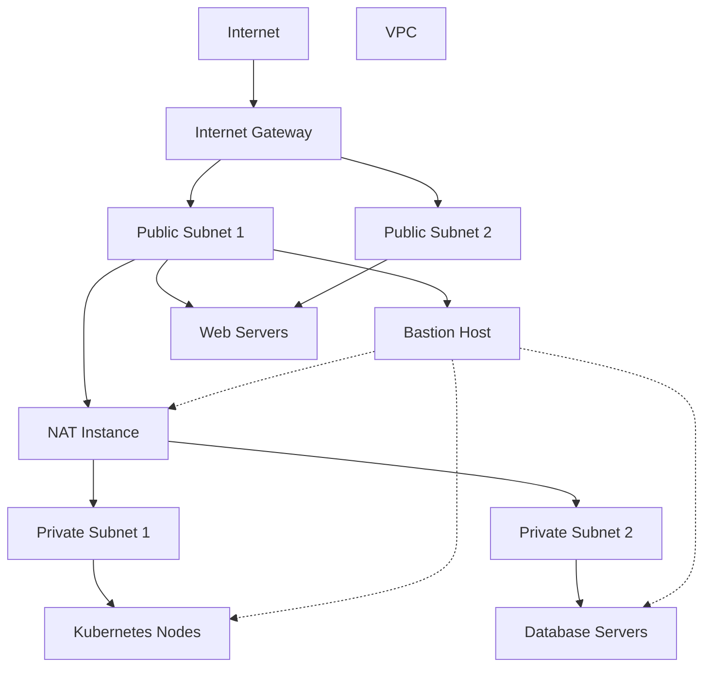

# AWS Kubernetes Networking Infrastructure (Terraform)

This project provides a production-ready, cost-effective AWS networking infrastructure for a Kubernetes cluster using Terraform. It implements a VPC with public and private subnets, a NAT instance (instead of a NAT Gateway), a bastion host for secure access, and robust security controls (Security Groups and Network ACLs).

---

## 🚀 Features
- **VPC** with public and private subnets across multiple Availability Zones
- **NAT Instance** for internet access from private subnets ("cheaper way")
- **Bastion Host** for secure SSH access
- **Internet Gateway** for public subnet access
- **Custom Security Groups** for web, database, and Kubernetes nodes
- **Network ACLs** for additional subnet-level security
- **Tested connectivity** and security between all components

---

## 🗺️ Architecture Diagram



---

## 📦 Project Structure

- `main.tf` — entry point, includes all modules/resources
- `vpc.tf` — VPC resource
- `subnets.tf` — public/private subnets
- `igw.tf` — Internet Gateway
- `route_tables.tf` — public/private route tables and associations
- `nat_instance.tf` — NAT instance and its network interface
- `bastion.tf` — Bastion host EC2 instance
- `security.tf` — Security Groups and Network ACLs
- `variables.tf` — all input variables
- `outputs.tf` — useful outputs (IPs, connection instructions)

---

## ⚙️ Requirements
- [Terraform](https://www.terraform.io/) >= 1.3
- AWS account with sufficient IAM permissions
- Existing EC2 key pair (see `key_pair_name` variable)

---

## 🚦 Quick Start

1. **Clone the repository:**
   ```sh
   git clone <your-repo-url>
   cd rsschool-devops-course-tasks
   ```
2. **Configure AWS credentials:**
   ```sh
   export AWS_ACCESS_KEY_ID=...
   export AWS_SECRET_ACCESS_KEY=...
   export AWS_DEFAULT_REGION=eu-central-1
   ```
3. **(Optional) Set variables:**
   - By default, AMI and key pair are set for Amazon Linux 2023 in `eu-central-1`.
   - To override, create `terraform.tfvars`:
     ```hcl
     ami_id      = "ami-xxxxxxxxxxxxxxxxx"
     key_pair_name = "your-key-pair"
     ```
4. **Initialize and apply:**
   ```sh
   terraform init
   terraform plan
   terraform apply
   ```
5. **Get connection info:**
   ```sh
   terraform output connection_instructions
   ```

---

## 🔒 Security & Best Practices
- **SSH access** to servers is only allowed via the bastion host (except for web servers' HTTP/HTTPS)
- **Security Groups** restrict traffic by role (web, db, k8s)
- **Network ACLs** provide subnet-level filtering
- **Private keys** (`*.pem`) are ignored by git (`.gitignore`)
- **After testing,** remove any wide-open SSH rules (0.0.0.0/0)

---

## 🧪 Testing Connectivity
- SSH to bastion host using the output public IP
- From bastion, SSH to NAT instance or any private instance
- Private instances can access the internet via NAT instance
- Public instances are accessible only on allowed ports

---

## 🗂️ File Descriptions
- **main.tf** — Terraform root module
- **vpc.tf** — VPC definition
- **subnets.tf** — Subnet resources
- **igw.tf** — Internet Gateway
- **route_tables.tf** — Route tables and associations
- **nat_instance.tf** — NAT instance, network interface, user-data
- **bastion.tf** — Bastion host EC2 instance
- **security.tf** — Security Groups and Network ACLs
- **variables.tf** — All input variables
- **outputs.tf** — Outputs for connection and resource IDs

---

## 📝 Notes
- This project is designed for educational and demo purposes, but follows best practices for real-world use.
- For production, restrict SSH access to trusted IPs only and monitor NAT instance health.
- For cost optimization, use NAT instance only for small/medium workloads.

---

## 📧 Questions?
Open an issue or contact the maintainer.
